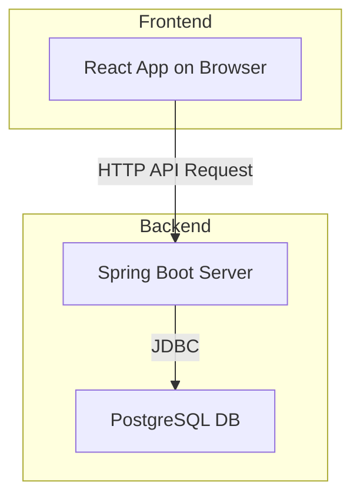

# Good-Night-4th-Hackathon
공연 좌석 예매 시스템 풀스택 구현

## 안내사항

- 본 레포지토리를 **fork**하여 과제를 수행하고, 완료시 PR을 보냅니다.
- 과제의 소스코드는 본인의 GitHub 레포지토리에 **Public**으로 올려주세요.
- 진행 간 문의사항은 이 레포지토리의 Issue로 등록해주세요.
- 구현 내용은 README.md 하단에 이어서 작성해 주세요.

## 과제 목표

공연 좌석 예매 시스템 구현

### 기술 스택

- Backend: 자유 선택 (Spring Boot, Node.js, Django, FastAPI 등)
- Frontend: 자유 선택 (React, Vue, Svelte, Vanilla JS 등)
- Database: 자유 선택
- 선택한 기술 스택에 대한 이유를 README에 간단히 설명해주세요

### 평가 항목

- 문제 해결 접근 방식에서 기술적 의사결정
- 구현 완성도와 문서화 수준

## 요구사항

### 최소 요구사항
> 아래 목표들을 달성하기 위한 구현 방법은 자유롭게 선택하세요.

1. **좌석 현황 표시**
    - 3x3 격자 형태로 총 9개의 좌석 표시
    - 각 좌석의 예약 가능/불가능 상태를 시각적으로 구분
2. **좌석 예약 기능**
    - 사용자가 빈 좌석을 클릭하여 선택
    - 페이지를 이동하여 예약자 정보 입력
    - 정보 입력 완료 후 예약 확정 시도
        - 99% 확률로 예약 성공 처리
        - 1% 확률로 의도적 실패 처리
    - 예약 성공/실패에 대한 명확한 피드백 제공
3. **API 엔드포인트**
    - 좌석 목록 조회 API
    - 좌석 예약 요청 API
    - HTTP 통신을 통한 데이터 교환
4. **코드 품질 보장**
    - 테스트 코드
    - 타입 체크
    - 린팅

### 기본 요구사항

> 아래 목표들을 달성하기 위한 구현 방법은 자유롭게 선택하세요.

> 각 목표를 어떻게 해결했는지 README에 설명해주세요.

1. **사용자 경험 개선**
    - **목표**: 사용자가 서비스를 이용할 때 발생할 수 있는 불편함 최소화
    - **예시**
        - 직관적인 UI
        - 네트워크 지연이 발생했을 때 편의성
        - 예약이 실패했을 때 편의성
        - 모바일에서 접속했을 때 편의성
2. **안정적인 서비스 운영**
    - **목표**: 예상치 못한 상황에서도 서비스가 안정적으로 동작
    - **예시**
        - 잘못된 요청이 들어왔을 때
        - 존재하지 않는 좌석을 예약하려 할 때
        - 서버 에러가 발생했을 때
        - 데이터 정합성 보장

### 심화 요구사항

> 아래 목표들을 달성하기 윈한 구현 방법은 자유롭게 선택하세요.

> 각 목표를 달성했음을 검증할 방법을 마련하세요.

> 시도한 방법이 어떤 방식으로 문제를 해결했으며 보유한 한계점에 대해 상세히 README에 설명해주세요.


1. **동시성 제어**
    - **상황**: 여러 사용자가 동시에 같은 좌석을 예약하려고 시도하는 경우
    - **목표**: 한 좌석에 대해 단 한 명만 예약에 성공하도록 보장
2. **실시간 좌석 상태 동기화**
    - 상황: UI에서 사용자들이 이미 선택된 좌석을 선택하게 되는 경우
    - 목표: 실시간 좌석 예약 상태를 확인할 수 있도록 실시간 동기화 제공
3. **선택한 좌석에 대한 우선순위 제공**
    - 상황 : 좌석 선택 후 예약자 정보를 입력하는 동안 다른 사용자가 좌석을 예약하게 되는 경우
    - 목표: 동일 좌석에 대해 먼저 선택을 한 사용자에게 예약 우선순위 제공

## 참고사항

### 진행 방식

- 최소 요구사항을 먼저 완성한 후 기본 기능을 구현해주세요
- 심화 요구사항은 구현에 실패해도 고민한 해결 방법이 있으면 작성해주세요.

### 필수 제출 항목

- **README.md**: 다음 내용을 반드시 포함
    - 프로젝트 실행 방법 (상세하게)
    - 기술 스택 선택 이유
    - 구현한 요구사항 체크리스트
    - 각 요구사항별 해결 방법 설명

### 선택 제출 항목

- 아키텍처 다이어그램
- 시연 영상 또는 GIF

---

### 아키텍처 다이어그램


<!-- 구현 내용 작성 -->

### 실행 방법 

**frontend**

frontend 디렉토리로 이동 후
```bash
npm install 
npm run dev

# Eslint
npm run lint
```

**backend**

backend 디렉토리로 이동 및 도커 데스크탑 실행 후
```bash
docker-compose up --build

# 백엔드 테스트(아무 위치에서 가능)
chmod +x ./gradlew
./gradlew test integrationTest
```

### 기술 스택 선정 이유

**Backend**
- **Spring Boot**: 강력한 생태계와 높은 안정성을 바탕으로 대규모 애플리케이션 개발에 적합하다고 판단했습니다. 특히 Spring Data JPA는 복잡한 데이터베이스 상호작용을 간소화하여 생산성을 높여줍니다. 내장된 테스트 프레임워크는 단위/통합 테스트 작성을 용이하게 하여 코드 품질을 보장하는 데 유리합니다.
- **PostgreSQL**: 오픈소스 관계형 데이터베이스 중에서 가장 높은 완성도를 자랑하며, 특히 동시성 제어에 강점을 가지고 있어 동시에 많은 트래픽이 발생하는 예약 시스템에 적합하다고 생각했습니다.

**Frontend**
- **React + TypeScript**: 컴포넌트 기반 아키텍처는 코드 재사용성을 높이고 유지보수를 용이하게 합니다. TypeScript를 통해 정적 타입을 지원함으로써 컴파일 시점에 오류를 잡아내어 코드의 안정성을 크게 향상시킬 수 있었습니다.
- **NProgress**: 페이지 이동이나 비동기 통신 시 발생하는 네트워크 지연 상황에서 사용자에게 시각적인 피드백(로딩 바)을 제공하여 UX를 개선했습니다.
- **Tailwind CSS**: 유틸리티-우선 CSS 프레임워크를 사용하여 별도의 CSS 파일 없이 HTML 내에서 직접 스타일을 정의함으로써 개발 속도를 높이고 일관된 디자인 시스템을 유지할 수 있었습니다. 반응형 디자인 또한 간편하게 적용할 수 있었습니다.

### 요구사항 체크리스트

**최소 요구사항**
- [x] 좌석 현황 표시
- [x] 좌석 예약 기능
    - 사용자가 빈 좌석을 클릭하여 선택
    - 페이지를 이동하여 예약자 정보 입력
    - 정보 입력 완료 후 예약 확정 시도
        - 99% 확률로 예약 성공 처리
        - 1% 확률로 의도적 실패 처리
    - 예약 성공/실패에 대한 명확한 피드백 제공
- [x] API 엔드포인트
    - `GET /api/seats`: 모든 좌석의 현재 상태 목록을 조회합니다.
    - `POST /api/seats/{id}/reserve`: 특정 좌석을 예약합니다.
- [x] 코드 품질 보장
    - backend
        - 단위 테스트: `SeatRepository`에 대해 H2 인메모리 데이터베이스를 사용하여 CRUD 및 정렬 기능이 정상 동작하는지 검증했습니다.
        - 통합 테스트: `SpringBootTest`를 통해 실제 애플리케이션 컨텍스트를 로드하고, `TestRestTemplate`으로 API 엔드포인트를 호출하여 종단 간(end-to-end) 흐름을 테스트했습니다.
    - frontend
        - 타입 체크: TypeScript를 사용하여 모든 컴포넌트와 상태, API 응답 데이터에 엄격한 타입을 적용했습니다.
        - 린팅: Eslint를 도입하여 코드 스타일을 통일하고 잠재적인 오류를 사전에 방지했습니다.

**기본 요구사항**
- [x] 사용자 경험 개선
    - 직관적인 UI
        - 좌석 상태(예약 가능: 초록, 불가능: 빨강, 선택됨: 파랑)를 색상으로 명확히 구분하여 사용자가 한눈에 현황을 파악할 수 있도록 했습니다.
    - 네트워크 지연이 발생했을 때 편의성
        - API 요청이 시작되면 화면 상단에 로딩 바(NProgress)를 표시하여 데이터 처리 중임을 사용자에게 알려 대기 시간을 덜 지루하게 만들었습니다.
    - 예약이 실패했을 때 편의성
        - 이미 예약된 좌석 선택 시 "이미 예약된 좌석입니다."라는 alert 메시지를 즉시 표시합니다.
        - 서버에서 의도된 실패(1%)가 발생했을 경우, "일시적 오류로 예약에 실패했습니다."라는 메시지를 표시하여 사용자가 재시도하도록 유도합니다.
    - 모바일에서 접속했을 때 편의성
        - Tailwind CSS의 반응형 유틸리티를 사용하여 모바일 화면에서도 좌석 맵과 예약 폼이 깨지지 않고 자연스럽게 보이도록 구현했습니다.
- [x] 안정적인 서비스 운영
    - 잘못된 요청이 들어왔을 때
        - **Frontend**: 예약자 정보(이름, 연락처) 입력 폼에 `required` 속성을 부여하고, 휴대폰 번호는 정규식을 통해 `010-XXXX-XXXX` 형식인지 실시간으로 검증합니다. 유효하지 않은 경우 에러 메시지를 표시하고 제출 버튼을 비활성화합니다.
        - **Backend**: `jakarta.validation.Valid` 어노테이션을 사용하여 `SeatReservationRequest` DTO의 유효성을 검사하고, 유효하지 않은 요청에는 HTTP 400(Bad Request) 상태 코드를 반환합니다.
    - 존재하지 않는 좌석을 예약하려 할 때
        - **Frontend**: UI 상에서 처음부터 9개의 좌석만 렌더링하므로 존재하지 않는 좌석에 대한 예약 시도가 원천적으로 차단됩니다.
        - **Backend**: `findById`를 통해 좌석 존재 여부를 확인하고, 없는 경우 HTTP 404(Not Found)를 반환합니다.
    - 데이터 정합성 보장
        - DB 테이블의 `seatId`에 Primary Key 제약조건을 설정하여 데이터 무결성을 유지합니다.

**심화 요구사항**
- [ ] 동시성 제어: 여러 사용자가 동시에 같은 좌석을 예약 시도하는 경우
    - **해결 방안**: 데이터베이스의 비관적 락(Pessimistic Lock)을 사용
    - **구현 아이디어**:
        1. Spring Data JPA의 `@Lock(LockModeType.PESSIMISTIC_WRITE)` 어노테이션을 `SeatRepository`의 `findById` 메소드에 추가합니다.
        2. 이렇게 하면 특정 좌석을 조회하는 트랜잭션이 해당 로우(row)에 쓰기 락(write lock)을 걸게 됩니다.
        3. 다른 트랜잭션이 동일한 좌석에 접근하려고 하면, 먼저 시작된 트랜잭션이 커밋되거나 롤백될 때까지 대기하게 됩니다.
        4. 이를 통해 '선착순'으로 한 명의 사용자만 예약을 성공적으로 마칠 수 있도록 보장할 수 있습니다.
- [ ] 실시간 좌석 상태 동기화: 한 사용자가 좌석을 예약하면 다른 사용자들의 화면에도 실시간으로 반영
    - **해결 방안**: WebSocket을 사용
    - **구현 아이디어**:
        1. Spring WebSocket과 STOMP 프로토콜을 사용하여 백엔드에 WebSocket 엔드포인트를 설정합니다.
        2. 사용자가 좌석 예매에 성공하면, 서버는 `/topic/seats`와 같은 특정 토픽으로 좌석 상태 변경에 대한 메시지를 브로드캐스트합니다.
- [ ] 선택한 좌석에 대한 우선순위 제공: 좌석 선택 후 예약 정보를 입력하는 동안 다른 사용자가 가로채지 못하도록 보장
    - **해결 방안**: 좌석에 '임시 선택' 상태와 타임아웃
    - **구현 아이디어**:
        1. 사용자가 좌석을 선택하면, 해당 좌석의 상태를 `PENDING`(임시 선택)으로 변경하고 타임스탬프를 기록합니다. 이 상태는 5분 등 일정 시간 동안만 유효합니다.
        2. 다른 사용자는 `PENDING` 상태의 좌석을 선택할 수 없습니다.
        3. 원래 사용자가 시간 내에 예약을 완료하면 상태를 `UNAVAILABLE`로 변경합니다.
        4. 만약 시간 내에 예약을 완료하지 않으면, 백그라운드 스케줄러(`@Scheduled`)가 주기적으로 타임아웃된 `PENDING` 좌석을 다시 `AVAILABLE`로 변경하여 다른 사용자가 예약할 수 있도록 합니다.